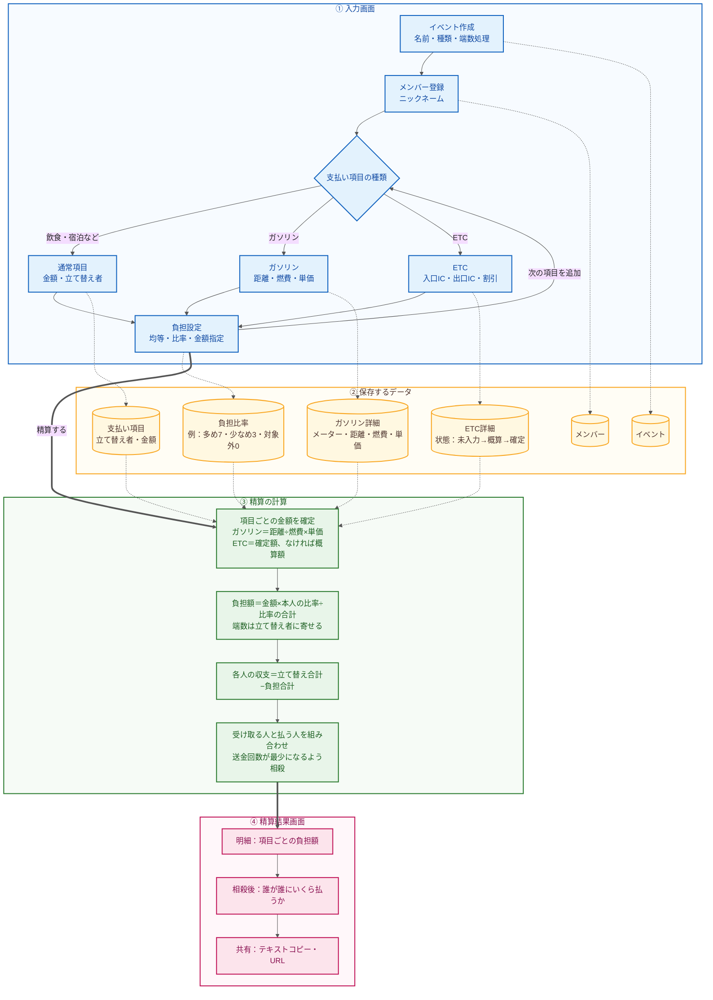

# 割り勘アプリ 全体設計図（1枚版）

```mermaid
%%{init: {'theme': 'base', 'themeVariables': {'background': '#FFFFFF', 'primaryTextColor': '#222222', 'lineColor': '#555555', 'fontSize': '16px'}}}%%
flowchart TD
    subgraph UI["① 入力画面"]
        A[イベント作成<br/>名前・種類・端数処理] --> B[メンバー登録<br/>ニックネーム]
        B --> C{支払い項目の種類}
        C -->|飲食・宿泊など| F[通常項目<br/>金額・立て替え者]
        C -->|ガソリン| G[ガソリン<br/>距離・燃費・単価]
        C -->|ETC| H[ETC<br/>入口IC・出口IC・割引]
        F & G & H --> I[負担設定<br/>均等・比率・金額指定]
        I -->|次の項目を追加| C
    end

    subgraph DATA["② 保存するデータ"]
        D1[(イベント)]
        D2[(メンバー)]
        D3[(支払い項目<br/>立て替え者・金額)]
        D4[(負担比率<br/>例：多め7・少なめ3・対象外0)]
        D5[(ガソリン詳細<br/>メーター・距離・燃費・単価)]
        D6[(ETC詳細<br/>状態：未入力→概算→確定)]
    end

    A -.-> D1
    B -.-> D2
    F -.-> D3
    G -.-> D5
    H -.-> D6
    I -.-> D4

    subgraph CALC["③ 精算の計算"]
        K1[項目ごとの金額を確定<br/>ガソリン＝距離÷燃費×単価<br/>ETC＝確定額、なければ概算額]
        K2[負担額＝金額×本人の比率÷比率の合計<br/>端数は立て替え者に寄せる]
        K3[各人の収支＝立て替え合計−負担合計]
        K4[受け取る人と払う人を組み合わせ<br/>送金回数が最少になるよう相殺]
        K1 --> K2 --> K3 --> K4
    end

    I ==>|精算する| K1
    D3 & D4 & D5 & D6 -.-> K1

    subgraph OUT["④ 精算結果画面"]
        R1[明細：項目ごとの負担額]
        R2[相殺後：誰が誰にいくら払うか]
        R3[共有：テキストコピー・URL]
        R1 --> R2 --> R3
    end

    K4 ==> R1

    %% ノードの色（淡い背景＋濃い文字で読みやすく）
    classDef ui fill:#E3F2FD,stroke:#1565C0,stroke-width:2px,color:#0D47A1
    classDef data fill:#FFF8E1,stroke:#F9A825,stroke-width:2px,color:#4E342E
    classDef calc fill:#E8F5E9,stroke:#2E7D32,stroke-width:2px,color:#1B5E20
    classDef out fill:#FCE4EC,stroke:#C2185B,stroke-width:2px,color:#880E4F

    class A,B,C,F,G,H,I ui
    class D1,D2,D3,D4,D5,D6 data
    class K1,K2,K3,K4 calc
    class R1,R2,R3 out

    %% 枠（サブグラフ）の色
    style UI fill:#F7FBFF,stroke:#1565C0,stroke-width:2px,color:#0D47A1
    style DATA fill:#FFFDF5,stroke:#F9A825,stroke-width:2px,color:#4E342E
    style CALC fill:#F6FBF6,stroke:#2E7D32,stroke-width:2px,color:#1B5E20
    style OUT fill:#FFF7FA,stroke:#C2185B,stroke-width:2px,color:#880E4F
```

| 色 | 意味 |
|---|---|
| 青 | ① 入力画面 |
| 黄 | ② 保存するデータ |
| 緑 | ③ 精算の計算 |
| ピンク | ④ 精算結果画面 |

- 実線の矢印：画面・処理の流れ
- 点線の矢印：データの保存・読み込み
- 太線の矢印：精算の実行と結果表示
