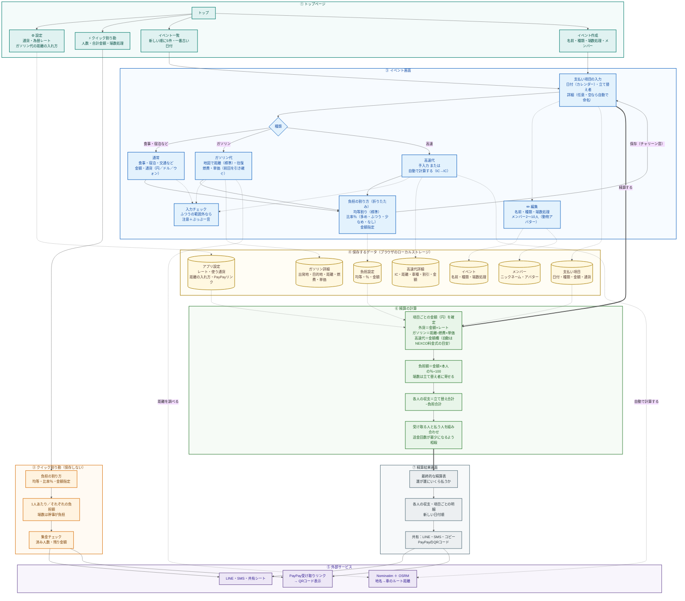

# 割り勘アプリ 全体設計図（1枚版）

| 色 | 意味 |
|---|---|
| 青緑 | ① トップページ |
| オレンジ | ② クイック割り勘 |
| 青 | ③ イベント画面（入力） |
| 黄 | ④ 保存するデータ |
| 紫 | ⑤ 外部サービス |
| 緑 | ⑥ 精算の計算 |
| 灰 | ⑦ 精算結果画面 |

- 実線の矢印：画面・処理の流れ
- 点線の矢印：データの保存・読み込み、外部サービスの呼び出し
- 太線の矢印：精算の実行と結果表示
